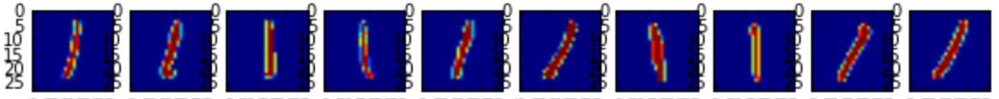
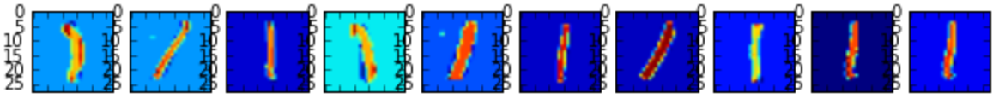
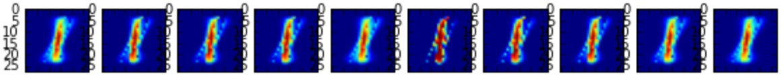

[](https://travis-ci.org/tgsmith61591/smrt)
[](https://codecov.io/gh/tgsmith61591/smrt)


# Synthetic Minority Reconstruction Technique ([SMRT](https://www.youtube.com/watch?v=tcGQpjCztgA))
*Handle your class imbalance more intelligently by using SMOTE's younger, more sophisticated cousin*


## Installation

Installation is easy. After cloning the project onto your machine and installing the required dependencies,
simply use the `setup.py` file:

```bash
$ git clone https://github.com/tgsmith61591/smrt.git
$ cd smrt
$ python setup.py install
```

## About

SMRT (Sythetic Minority Reconstruction Technique) is the new SMOTE (Synthetic Minority Oversampling TEchnique).
Using variational auto-encoders, SMRT learns the latent factors that best reconstruct the observations in each
minority class, and then generates synthetic observations until the minority class is represented at a user-defined
ratio in relation to the majority class size.

SMRT avoids one of SMOTE's greatest risks: In SMOTE, when drawing random observations from whose k-nearest
neighbors to synthetically reconstruct, the possibility exists that a "border point," or an observation very close to
the decision boundary may be selected. This could result in the synthetically-generated observations lying
too close to the decision boundary for reliable classification, and could lead to the degraded performance
of an estimator. SMRT avoids this risk implicitly, as the [``VariationalAutoencoder``](smrt/autoencode/autoencoder.py)
learns a distribution that is generalizable to the lowest-error (i.e., most archetypal) observations.

__See [the paper](doc/smrt.tex) for more in-depth reference.__

## Example

The [SMRT example](examples/) is an ipython notebook with reproducible code and data that compares an imbalanced
variant of the MNIST dataset after being balanced with both SMOTE and SMRT. The following are several of the resulting
images produced from both SMOTE and SMRT, respectively. Even visually, it's evident that SMRT better synthesizes data
that resembles the input data.

### Original:

The MNIST dataset was amended to contain only zeros and ones in an unbalanced (~1:11, respectively) ratio. Here are
several of the original images for reference:
<br/>


### SMOTE:

The unbalanced set was balanced with SMOTE as a baseline to exemplify the result of the current standard approach.
These are the resulting images:
<br/>


### SMRT:

Finally, the unbalanced set was balanced using a variational auto-encoder and the SMRT algorithm. These are the
resulting images. Note how much more they resemble the actual input images:
<br/>


### Notes

- See [examples](examples/) for usage
- See [the paper](doc/smrt.tex) for more in-depth documentation
- Information on [the authors](AUTHORS.md)
